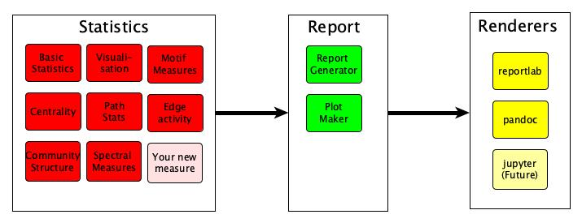

Technical Details
=================

The package is designed to be strongly extensible allowing ours and others to
add additional network statistics to our package. In fact we strongly encourage
pull requests to add your statistics to the package.

The package can be divided into three different components using the following schema: 

In essence `nest` performs 5 actions:

1. It processes tabular data into a (temporal) (un)weighted graph
2. It constructs a list of statistics, based on the data type.
3. It computes those statistics on the current set of data
4. It generates a report based on these statistics.
5. It renders these report in the required format.

In the next few sections we will discuss each of these sections in detail to
allow others to extend our framework and add additional statistics. 

Statistics
----------

The graph statistics rely on a object orientated structure, which both allows
`nest` to find all of the statistics, and subsequently the `report_generator`
and `renderer` to produce a report based on these statistics. 

Nest will import all statistics and then report all of the results
using the output method selected. However, in order to do this the statistic
need to meet a small number of requirements. 

First, each of these statistics should be constructed as a class which must
inherit from the `baseStatClass` class or in the case of a statistic which
leverages a time series of graphs `baseTimeSeriesStats`.

Second, the class statistic should be named with underscores for spaces (rather
than camelcase). Finally, each statistic must implement or inherit 3 methods, 

.. code-block:: python

   def __init__(self, G, optionsDict):

This method takes either a single graph or a graph time series and compute the statistic in question 

.. code-block:: python

  def get_report(self):

Returns the output of the statistic

.. code-block:: python

   def get_csv(self):

Returns the output of the statistic in the csv form

Note: the argument optionsDict allows us to pass options to each of the
statistics, however please note that the same options will be passed to all
methods, and therefore options should be placed in optionsDict[methodName][OPTIONNAME].

While this seems complex, in reality is due to inheritance it is very simple to
add additional statistics, for example to add a statistic which computes the
number of nodes: 

.. code-block:: python

   class number_of_nodes(baseStatClass):
      def __init__(self, G, optionsDict):
         self.data = G.number_of_nodes()

Including Plots 
^^^^^^^^^^^^^^^

For plots to be included in the output, the statistic should implement the makePlot method, 
with the following signature:

.. code-block:: python

    def makePlot(self):

This method should return a list of figure handles for each of the plots to be
added the report. Again, while this sounds complex, ``nest`` has several
helpful functions to make this easy. For example, to produce a histogram of a
statistic (say a centrality measure) we can inherit from the
``baseWithHistPlot``, and create an attribute called ``histdata`` which will
then be used to construct the histogram.

So for example to produce a plot with Eigenvector centrality, we would use the
following code:

.. code-block:: python

   class Eigenvector(baseWithHistPlot):
      def __init__(self, G, optionsDict):
         q1 = nx.eigenvector_centrality_numpy(G)
         q2 = list(q1.values())
         self.data = __getStats__(q2)
         self.histData = q2

where the ``__getStats__`` function constructs a small summary of the centrality scores.

For additional plots, we also provide a set of methods to produce plots which are in: 
``nest.reportgenerator.plot_maker`` 
including lineplots, images or otherwise, or simply using the matplotlib and
seaborn libraries to return a list of figure handles for each required plot. 

Time series statistics 
~~~~~~~~~~~~~~~~~~~~~~~

Time series statistics are very similar to regular statistics, however they inherit from 
`baseTimeSeriesStats` rather than `baseStatClass`, and rather than an
individual graph they take a dictionary of graphs where the keys are the time stamps.

Again, nest has implemented a large number of graph/network time series
statistics although more could be added, and again we encourage others to
include their statistics in our package. 

``nest`` also makes it very easy to turn graph/network statistics into a time
series statistic by simply computing the statistic on each element of the time
series and then producing a time series plot of the resultant statistic.  

For example if we wanted to make a time series plot of the number of nodes
statistic we defined earlier, we can simply inherit from
``baseTimeSeriesFromBase``, which then will add all of the required methods to
compute the resultant statistic, as follows: 

.. code-block:: python

   class number_of_nodes_TS(baseTimeSeriesFromBase):
      inbuiltMethod = number_of_nodes

This will then produce summaries of the resultant time series, as well as plots
of the resultant time series.

Report and Renderer
-------------------

The ``report`` and ``renderer`` modules convert the statistics into a report in the
required format. The work is divided between the modules as follows:

The ``report`` module is responsible for collating all of the statistics to run on the dataset in question, 
and arranging the ordering of each of the outputs in the document. The logic to
do this is mostly included in ``nest.reportgenerator.report_generator``. 

In contrast the ``renderer`` takes the ordered output and then creates an
output in the correct format for this statistic. It does this using a similar
object orientated structure which allows us to change the renderer, without affecting any of the underlying logic. 

If you wish to implement a new renderer, it must implement each of the required
methods the signatures of which can be found in ``nest.renderer.base``. 
Note, that some of the methods may be inappropriate for your particular renderer (i.e. a pagebreak), 
in this case simply implement a blank method e.g.: 

.. code-block:: python

    def addPageBreak(self):
      pass

